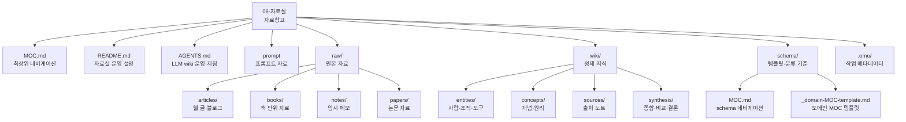

# 자료창고 폴더 구조

대상 폴더: `06-자료실/`

`자료창고`는 현재 vault의 `06-자료실/`을 기준으로 작성했다.

## 운영 관점

| 영역 | 역할 |
|---|---|
| `raw/` | 원본성 보존. 자료를 성격별로 보관 |
| `wiki/` | LLM이 정제한 지속 지식 관리 |
| `schema/` | 템플릿, 분류 기준, 도메인 MOC 관리 |
| `MOC.md` | `06-자료실/` 전체 네비게이션 |
